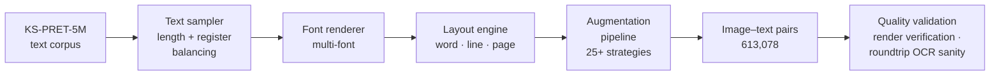

# Koshur Pixel

> The first large-scale synthetic OCR dataset for Kashmiri Nastaliq — 613,078 image–text pairs generated with the **SynthOCR-Gen** framework from the KS-PRET-5M corpus, spanning 25+ augmentation strategies across multiple fonts, granularities, and document degradations.

[](https://arxiv.org/abs/2606.23144)
[](https://arxiv.org/abs/2606.23144)
[](https://huggingface.co/)
[](LICENSE)

---

## The Problem

Optical Character Recognition for low-resource scripts is gated almost entirely by training data. For Kashmiri Nastaliq:

- No large-scale annotated OCR dataset exists publicly.
- Manual annotation does not scale — Nastaliq contextual ligatures, dense glyph shaping, and orthographic variability make accurate character-level labeling expensive and error-prone.
- General Arabic and Urdu OCR corpora transfer to Nastaliq only partially; Kashmiri vocabulary, diacritization patterns, and word morphology differ enough to leave a measurable accuracy gap.

The result: every prior Kashmiri OCR effort has been bottlenecked by data, not by model architecture.

## Motivation

Koshur Pixel is the data-side intervention paired with the [KoshurOCR](https://github.com/Faizaniqbal52/KoshurOCR) modeling research program. The hypothesis:

> A diverse, large-scale synthetic dataset — generated with realistic font, layout, and degradation variation — can serve as a scalable, cost-effective foundation for training and benchmarking OCR systems for severely under-resourced scripts.

If true, this provides a reusable recipe for other low-resource scripts (Sindhi, Pashto, Punjabi-Shahmukhi) facing the same data scarcity.

## Research Questions

- **RQ1.** Can large-scale synthetic OCR data substitute for scarce real annotations in low-resource scripts?
- **RQ2.** Which augmentation strategies transfer to real-world Kashmiri document degradations versus which are decorative?
- **RQ3.** How does dataset granularity (word-level vs line-level vs full-page) interact with downstream OCR architecture choices?

## What's in the Dataset

| Property | Value |
|---|---|
| **Image–text pairs** | **613,078** |
| **Source corpus** | KS-PRET-5M |
| **Generator** | SynthOCR-Gen framework |
| **Fonts** | Multiple Nastaliq fonts spanning typographic styles |
| **Granularities** | Word, line, full-page |
| **Augmentation strategies** | **25+** (see below) |
| **Format** | Image + UTF-8 transcription pairs |
| **License** | CC-BY-4.0 |

### Augmentation strategies (25+)

Grouped by category:

- **Geometric** — rotation, skew, perspective warp, scale jitter
- **Photometric** — brightness, contrast, gamma, color jitter, JPEG compression
- **Optical degradations** — Gaussian blur, motion blur, defocus, sensor noise
- **Print/scan artifacts** — ink bleed, page yellowing, fold marks, salt-and-pepper noise, dropout
- **Layout perturbations** — line spacing, kerning, character spacing, baseline drift
- **Real-world simulation** — occlusion, watermarks, stamps, fold creases

Full augmentation catalog with parameters: [`docs/augmentations.md`](docs/augmentations.md).

## Pipeline



## Recommended Use

Koshur Pixel is designed as one component of a heterogeneous training mix. The companion [KoshurOCR](https://github.com/Faizaniqbal52/KoshurOCR) research program demonstrates that combining Koshur Pixel (synthetic) + real word-level data + line-level data produces stronger OCR performance than any single source — *up to a point* (see the decoder-sequence-collapse finding documented in KoshurOCR).

Suggested splits:
- 80% synthetic (Koshur Pixel) for backbone visual representation learning
- 15% real word-level for fine-tuning to authentic glyph distributions
- 5% real line-level for sequence-modeling adaptation

## Reproducing the Dataset

The SynthOCR-Gen framework is included in this repository. To regenerate the dataset (or generate a variant):

```bash
git clone https://github.com/Faizaniqbal52/Koshur-Pixel.git
cd Koshur-Pixel
pip install -r requirements.txt

# Generate a 10K-pair sample
python synth_ocr_gen/generate.py \
    --corpus data/ks_pret_5m_sample.txt \
    --fonts assets/fonts/ \
    --augmentations configs/full.yaml \
    --output-dir output/ \
    --n-samples 10000
```

Full generation pipeline reproduction: [`docs/regeneration.md`](docs/regeneration.md).

## Examples

| Image (rendered) | Transcription |
|---|---|
| `samples/word_001.png` | کاشُر |
| `samples/line_001.png` | یہ ایک نمونہ جملہ ہے |
| `samples/page_001.png` | (full-page sample with literary text) |

Sample grids and the format spec: [`docs/format.md`](docs/format.md).

## Quality and Limitations

**Quality validation procedures performed:**

- Render verification — each generated image re-decoded through a reference OCR pipeline; gross rendering errors filtered.
- Length-balance checks — distribution of sequence lengths matches the KS-PRET-5M source.
- Augmentation calibration — augmentation parameters tuned by reference to real-world document scans.

**Known limitations:**

- **Synthetic-to-real domain gap.** Models trained only on Koshur Pixel underperform versus models trained on a mix; pure synthetic is not a substitute for some real data.
- **Font coverage.** Limited to publicly available Nastaliq fonts; specialty calligraphic styles (Khat-e-Naqsh, decorative variants) are out of distribution.
- **Layout coverage.** Page-level samples follow modern print layout; historical manuscript layouts are not covered.
- **No handwriting.** This dataset is print-rendered only. Handwritten Nastaliq remains an open data problem.

## Lessons Learned

- **Augmentation diversity beats augmentation strength.** 25 weak, well-calibrated augmentations outperformed 10 strong ones in downstream OCR accuracy.
- **Synthetic data is a scaffold, not a substitute.** Best results consistently came from synthetic + real mixes, not from scaling synthetic alone.
- **Font diversity matters more than corpus size beyond ~500K samples.** Returns to additional samples diminish; returns to additional fonts do not.
- **Render verification catches more bugs than human spot-checking.** A roundtrip OCR sanity check on rendered output caught silent font-substitution errors that visual inspection missed.

## Future Work

- Hand-written Nastaliq extension via cooperation with calligraphers.
- Domain-specific subsets: historical manuscripts, journalism, technical documents.
- Cross-script extension: Pashto, Sindhi, Punjabi-Shahmukhi using the same SynthOCR-Gen framework.

## Citation

```bibtex
@misc{malik2026koshurpixel,
  author       = {Malik, Haq Nawaz and Nissar, Nahfid and Iqbal, Faizan},
  title        = {Koshur Pixel: A Large-Scale Synthetic OCR Dataset for Kashmiri},
  year         = {2026},
  eprint       = {2606.23144},
  archivePrefix= {arXiv},
  primaryClass = {cs.CV}
}
```

## Authors

- **Haq Nawaz Malik**
- **Nahfid Nissar**
- **Faizan Iqbal** · [herewithfaizan.in](https://herewithfaizan.in) · [ifaizan041@gmail.com](mailto:ifaizan041@gmail.com)

## License

- **Dataset:** CC-BY-4.0 — attribution required, derivatives permitted
- **Code (SynthOCR-Gen):** Apache 2.0 — see [LICENSE](LICENSE)

## Related Work

- [**KoshurOCR**](https://github.com/Faizaniqbal52/KoshurOCR) — modeling research program that consumes this dataset
- [**Koshur Diacritizer**](https://github.com/Faizaniqbal52/Koshur-Diacritizer) — diacritic restoration (arXiv:2606.15883)
- [**KoshurAI**](https://github.com/Faizaniqbal52/KoshurAI) — Kashmiri↔English neural machine translation
